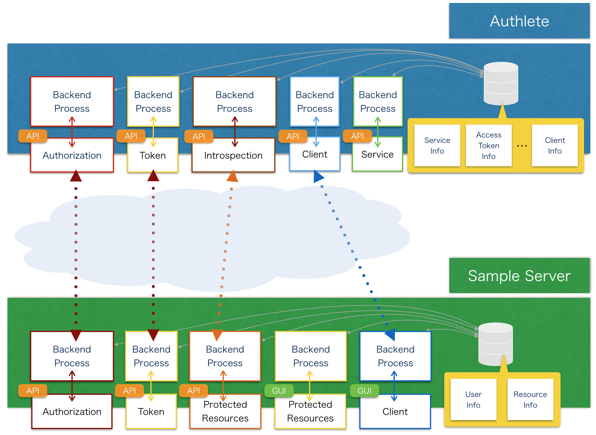

# Overview

## What is this project?

This project is an example of the server (service provider) implementation using [Authlete](https://www.authlete.com/).  
The objective of this project is to illustrate how to implement authorization and resource servers with [Authlete APIs](https://www.authlete.com/authlete_web_apis.html) in **Java**.

## What can I do with this?

Just like social networking services in general, you can do the following things:

* Log into the sample server as pre-defined users.
* See their profile and feeds.  
* Manage (create, update, delete) their client applications.  
* Have their client applications get authorized or denied by the end users.  
* Access the protected resources (profile and feed information) through the APIs.

## How to use this?

Please, see [Getting started](#getting-started).


# Architecture

The following picture describes the rough architectures of Authlete and the sample server and how they communicate with each other.

  

The picture above indicates two important points:

1. **The sample server can delegate the part of process to Authlete via its API.**  
  
    If you want to make your service support [OAuth 2.0](http://oauth.net/2/) and [OpenID Connect](http://openid.net/connect/), it will be one of the most bothering and time-consuming things to implement the process of validating a bunch of parameters given by the client applications.  
However, the sample server doesn't perform the validation by itself, when its Authorization and Token API receives the parameters from its client apps. Instead, it just delegates the validation task to Authlete, which processes it precisely based on the rules described in [RFC 6749](http://tools.ietf.org/html/rfc6749), [OpenID Connect Core 1.0](http://openid.net/specs/openid-connect-core-1_0.html) and other related specifications.

2. **The sample server doesn't host data regarding authorization.**  
  
    As the picture above shows, Authlete hosts the data that is required for authorization processes. Then, the sample server is free from design, implementation and maintenance of scalability and database. 


# Getting started

## 0. Prerequisites ##

* You must be registered into [Authlete](https://www.authlete.com/) and have your **service owner credentials** (**API key** and **API secret** of the **service owner**). If you don't, sign up [here](https://www.authlete.com/signup.html) and get them.  

* Eclipse is assumed to be your IDE.

## 1. Service Registration ##
The metadata of the service needs to be registered into Authlete.  

To do this, send a JSON object ([src/test/data/service/authlete-sample-server-java.json](src/test/data/service/authlete-sample-server-java.json)) to Authlete's [/service/create API](https://www.authlete.com/authlete_web_apis_service.html#service_create) by executing the following curl command. As for ```${AUTHLETE_API_HOST}```, see [Authlete API Host](https://www.authlete.com/authlete_web_apis_common.html#common_host).  

```
curl --user ${SERVICE_OWNER_API_KEY}:${SERVICE_OWNER_API_SECRET} \
  -H Content-Type:application/json \
  -d @authlete-sample-server-java.json \
   https://${AUTHLETE_API_HOST}/api/service/create
```

The endpoint returns a JSON response, which contains **service credentials** (**API key & API secret of the service**) as follows.  
    
```
{  
    "accessTokenDuration":36000000,
    "accessTokenType":"Bearer",
    "apiKey":23415970377,
    "apiSecret":"Vyh7m7RU-QU8efB_0JoOauGSjy9Ve9LJBIAeNw2Q60c",
    ...
}
```
Remember the value of the **apiKey** and **apiSecret** in the response for later use.  
When you forget the service credentials, use the [/service/get/list API](https://www.authlete.com/authlete_web_apis_service.html#service_get_list).

## 2. Clone this repository ##

```
$ git clone https://github.com/authlete/authlete-java-sample-server.git
```

## 3. Import the project into Eclipse ##

1. Launch Eclipse.  

2. (On Menu) Click **File** -> **Import**.  

3. Select **Existing project into workspace**.  

4. Choose this project and Click **Finish**.  

## 4. Configure authlete.properties ##

1. Open src/main/resources/authlete.properties.
2. Set ```${AUTHLETE_API_HOST}``` (For more details, see [Authlete API Host](https://www.authlete.com/authlete_web_apis_common.html#common_host)) and your credentials to the properties as follows.

    ```
    #
    # authlete.properties
    #
    base_url = {AUTHLETE_API_HOST}
    service_owner.api_key = {YOUR_SERVICE_OWNER_API_KEY}
    service_owner.api_secret = {YOUR_SERVICE_OWNER_API_SECRET}
    service.api_key = {YOUR_SERVICE_API_KEY}
    service.api_secret = {YOUR_SERVICE_API_KEY_SECRET}
    ```

## 5. Configure Eclipse 'Run Configuration' and Run the sample server ##

1. (In Eclipse) Right click the project.  
 
2. Click **Run As** -> **Run Configurations...**.  
 
3. Double click **Maven Build**, then new configuration will appear.  

4. In the **Name** field, any value can be set.
 
5. Click **Browse Workspace...** and choose **sample-java-authlete-server** project as **Base directory**

5. Set "**jetty:run**" in the **Goals** section.  
 
6. Click **Apply**.  
 
7. Click **Run** (The sample server starts running).  


## 6. Try the sample server
The sample server has several functions just like social networking services in general.   
 
Let's try the sample server using pre-defined users, "**Joe**" and "**May**"
(For more detail about the user definition, see [src/main/webapp/WEB-INF/shiro.ini](src/main/webapp/WEB-INF/shiro.ini)).


### A. Log into the sample server ###
First of all, log into the sample server as **Joe** as follows. 

1. Go to [sample server top page](http://localhost:8080/authlete-sample-server), then you'll see the following login form.  

2. As below, put **joe** as the user name, and **pass** as the password. Then, push the "**Login**" button.

	

### B. Create a client application ###
If you have successfully logged in as **Joe**, let's create his client application as below.
 
1. Go to the [develop page](http://localhost:8080/authlete-sample-server/user/develop)

2. Hit the "**Create a new client app**" button to go to the client create page.

3. On the client create page, set some of the parameters for the client app according to the following table.

	| name | value |
	| :------: | :-------: |
	| Client Type | public |
	| Redirect URIs | http://authlete-sample-client-app.com/callback |
	| Response Types | code |
	| Grant Types | authorization_code |
	| Application Type | native |
	| Client Name | authlete_sample_client_app |


4. Hit the "**Create**" button.

5. On success, you'll be back to the app detail page (```http://localhost:8080/authlete-sample-server/user/develop/${CLIENT_ID}/detail```).  
Remember the value of "**Client Id**" and "**Redirect URIs**" on the page for later use.    

### C. Authorizing a client application & Access the protected resources ###
After the steps above, the user **Joe** has at least one client application.  
Let's make some assumptions about the app as below. 

* His client app accesses the protected resources information (meaning "profile" and "feed" information here) of its end users. 
* **May** is one of the end users of his client app. 

In order for **Joe**'s client app to access **May**'s protected resources, the app needs to get authorized by **May** and eventually obtain an **access token**.  
The figure below roughly shows how this is done in what is called "**Authorization Code Flow**".


1. **authorization request**  

    First of all, Joe's client app makes **authorization request** to the sample server's **authorization endpoint**, which is defined as ```/api/auth/authorization```.   

    To make authorization request from Joe's client app, access the following URL on your browser.
    Don't forget to replace the ```${CLIENT_ID}``` with the **Client Id** value of the app you created as Joe's client app.

	```
	http://localhost:8080/authlete-sample-server/api/auth/authorization?client_id=${CLIENT_ID}&response_type=code&scope=read_profile+read_feed+write_feed
	```
	
	For more details regarding the query parameters above, see [Authorization API Document](https://www.authlete.com/authlete_web_apis_authorization.html#auth_authorization)

2. **UI for authorization**  

    Then, the authorization endpoint returns the UI for your to authorize the app as follows.

	

3. **grant authorization**  

    In order to grant authorization to the app as the user "**May**"", put "**may**" as the name and "**pass**" as the password and then hit the "**Authorize**" button on the UI.

4. **authorization code**  

    After authorizing the app, the authorization endpoint redirects you to the URI, ```http://authlete-sample-client-app.com/callback```, which was given as "**Redirect URIs**" when you created the app.  

    As in the figure below, the URI contains a "**authorization code**" as the value of the query parameter "**code**". 
Remember this value for the next step. Also, note that **authorization codes expire in a short time**.  Then, you have to go to the next step to use the code soon after it was issued.

	
	 
    *Note that the redirect URI (you've registered on creating the client app), which is "authlete-sample-client-app.com/callback" here, will be **not found** since it's a dummy URI but it doesn't affect extracting the authorization code.*

5. **token request (with authorization code)**  
    
    With the authorization code obtained in the step.4, the client app makes **token request** to the sample server's **Token Endpoint**, which is defined as ```/api/auth/token```.  

    It can be done by executing the following curl command. Don't forget to replace the ```${CLIENT_ID}``` with the **Client Id** value of the app you've created as Joe's client app in the step.2 and ```${AUTHORIZATION_CODE}``` with the **authorization code** you obtained in the step.5.

    ```
    curl http://localhost:8080/authlete-sample-server/api/auth/token \
     -d grant_type=authorization_code \
     -d client_id=${CLIENT_ID} \
     -d code=${AUTHORIZATION_CODE}
    ```

6. **access token**

    If you successfully made token request, the token endpoint returns JSON including an access token as below.  
See ["5.1. Successful Response" of RFC 6749](http://tools.ietf.org/html/rfc6749) for other properties contained in the response.

    ```
    {
        "scope":"read_feed read_profile write_feed",  
        "expires_in":36000000,  
        "token_type":"Bearer",  
        "refresh_token":"cCik2cMWH3cBpnaXc-hknRdMRQmJPddqakbGndVdJlY",
        "access_token":"Nz_LCwGYW4RQ7ep_Y2V8ksZN7zYOGBR9xz4-MKZmwb0"
    }
    ```    

7. **access protected resource (with access token)**  

    The sample server provides several APIs to access the protected resource. All the APIs that are defined in the sample server are described below.

	| Endponint | Description | Parameters |
	| --------- | ----------- | --------- |
	| ```/api/resources/profile/${user_id}``` | Get the profile of a specified user | user_id: The user id associated with the profile to get.<br/>The default possible values are "joe" and "may". |
	| ```/api/resources/feed/${feed_id}``` | Get a specified feed | feed_id: The id of a feed to get.<br/>The default possible values are 0,1,2 and 3. |
	| ```/api/resources/feed/list/${user_id}``` | Get feed list of a specified user | user_id: The user id associated with the feed list to get.<br/>The default possible values are "joe" and "may". |
	| ```/api/resources/feed/create``` | Add a specified feed to the feed list of the user associated with the access token | JSON representing the feed to create is expected to be contained in Entity Body. |  


    To show the API usage, here's how to access the ```/api/resources/feed/list/${user_id}``` endpoint.
	
	1. Base64 encode the access token (that you obtained in the step.6) as show in the following Linux command.
	
		```
		echo -n ${ACCESS_TOKEN} | base64
		```
	2. With the encoded access token, execute the following curl command to access ```/api/resources/feed/list/${user_id}``` endpoint (Note that ```${user_id}``` is replaced with "may").

		```
		curl -H "Authorization: Bearer ${base64_encoded_access_token}" \
	    http://localhost:8080/authlete-sample-server/api/resources/feed/list/may
		```
		
		As the command above shows, the access token is received by the endpoint according to "**Bearer Token Usage**", 
		which is recommended by [RFC6750](http://tools.ietf.org/html/rfc6750).
    

8. **protected resource**  

    By executing the curl command in the last part of the step.7, the following JSON, which represents **May**'s feed list, is returned.

	```
	[  
	    {  
	        "number":2,
	        "userId":"may",
	        "title":"Coocked Lasagna!",
	        "content":"I cooked tasty lasagna with my friends.",
	        "locked":true,
	        "createdAt":"2014-10-10T19:17:43.42",
	        "modifiedAt":"2014-10-10T19:17:43.42"
	    },
	    {  
	        "number":3,
	        "userId":"may",
	        "title":"Japan",
	        "content":"Visited Japan and saw some summer festivals there. That was just awesome.",
	        "locked":false,
	        "createdAt":"2014-10-10T19:17:43.42",
	        "modifiedAt":"2014-10-10T19:17:43.42"
	    }
	]
	```

# License

Apache License, Version 2.0


# Links

* [Authlete Home Page](https://www.authlete.com/)
* [Authlete Documents](https://www.authlete.com/documents.html)
* [Authlete Web APIs](https://www.authlete.com/authlete_web_apis.html)
* [authlete-java-common](http://github.com/authlete/authlete-java-common)
* [authlete-java-client-jaxrs](https://github.com/authlete/authlete-java-client-jaxrs)
